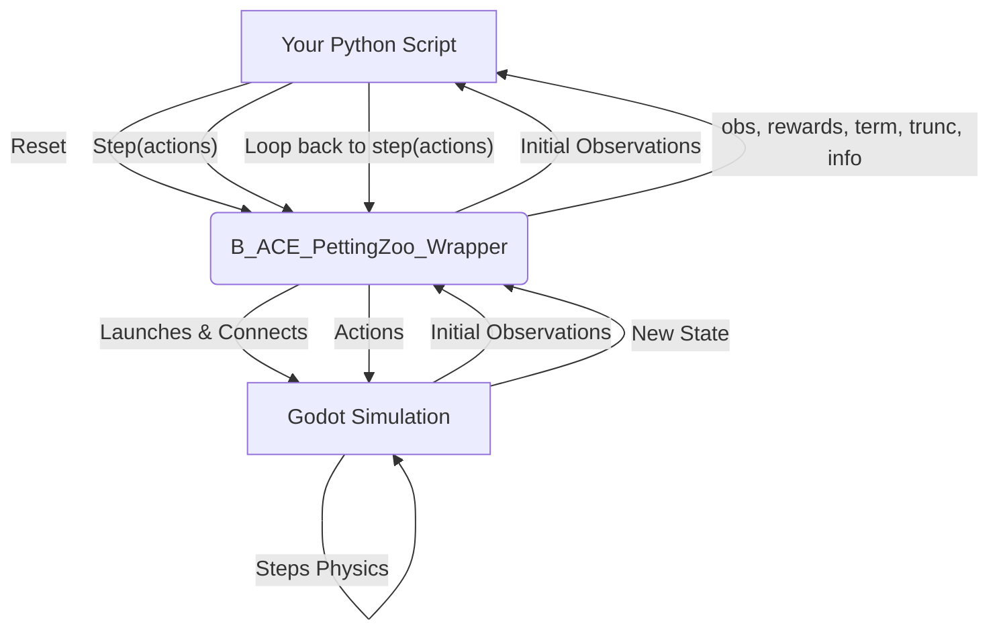

# B-ACE: Beyond Visual Range Air Combat Environment

[](https://opensource.org/licenses/MIT) [](https://www.python.org/downloads/) [](https://pettingzoo.farama.org/)

Built on the Godot game engine, B-ACE leverages Multi-Agent Reinforcement Learning (MARL) to explore advanced techniques in autonomous air combat agent development. The environment provides a flexible and accessible platform for the research community, enabling the rapid prototyping and evaluation of AI-based tactics and strategies in complex air combat settings.

The [Godot](https://godotengine.org/) engine offers an intuitive interface, flexible scripting (GDScript), and support for multiple languages (C#, VisualScript, C++), facilitating rapid prototyping and iteration. Its user-friendly design lowers the barrier to entry for new developers and researchers. Godot is completely free under the MIT license, allowing unrestricted access, modification, and distribution, contrasting with commercial engines that impose costs and restrictions, especially for military and government applications.

## Key Features

* **Open-Source and Extensible:** Researchers can easily modify and extend the environment in both Python and the Godot Engine to suit their specific needs.
* **MARL-Ready:** Fully compatible with popular reinforcement learning libraries through the [PettingZoo](https://pettingzoo.farama.org/) API.
* **Simplified BVR Dynamics:** Focuses on the key aspects of air combat, offering a balance between realism and computational accessibility.
* **Flexible Scenarios:** Supports single and multi-agent learning scenarios, ideal for exploring both individual and cooperative agent behaviors.

## 🚀 Getting Started

The best way to start is by running the simple example to verify your setup. We recommend using a Python virtual environment.

**1. Prerequisites**

* Python 3.8 or higher

**2. Clone the Repository**

```bash
git clone https://github.com/andrekuros/B-ACE.git
```

**3. Set Up a Virtual Environment and Install Dependencies**

```bash
# Create a virtual environment (e.g., using venv)
python -m venv venv
# Activate it
# On Windows
venv\Scripts\activate
# On macOS/Linux
source venv/bin/activate

# Install the minimum requirements
pip install tianshou==1.2.0 pettingzoo==1.24.3
```

**4. Run the Simple Example**
This will launch the Godot simulation and you will see the agents interacting in the environment.

```bash
python ./run_simple_example.py
```

## ⚙️ How It Works: Simulation Flow

The interaction between your Python agent code and the Godot simulation is managed by the `B_ACE_GodotPettingZooWrapper`. This wrapper is built using the excellent [GodotRL Agents](https://github.com/Dmitrii-I/GodotRL) library, which handles the low-level communication.

The wrapper implements the standard [PettingZoo ParallelEnv](https://pettingZoo.farama.org/api/parallel/) interface, allowing you to use familiar functions like `reset()` and `step()`.

The typical interaction flow is as follows:



## 📖 Usage and API

The B-ACE environment follows the Gym/PettingZoo standard. You just need to instantiate the wrapper and use its methods to control the simulation.

### Core Methods

* `__init__(**configs)`: Initializes the environment. It launches the Godot simulation, sets up observation/action spaces, and defines the agents based on the provided configuration.
* `reset()`: Resets the environment to its initial state, returning a dictionary of initial observations for each agent.
* `step(actions)`: Takes a dictionary of actions (one for each agent) and steps the environment forward. It returns the next observations, rewards, terminations, truncations, and info dictionaries.
* `observation_space(agent)`: Returns the observation space for a given agent.
* `action_space(agent)`: Returns the action space for a given agent.


## 🔧 Environment Configuration

The simulation's behavior is controlled by a `.json` configuration file (e.g., `Default_B_ACE_config.json`). You can modify this file or pass the path to your own custom config during environment initialization.

**Key Configuration Options:**

* `EnvConfig`: General environment settings.
  * `env_path`: Path to the Godot executable binary.
  * `port`: Communication port.
  * `renderize`: Set to `true` to see the simulation, `false` for headless execution.
  * `speed_up`: Simulation speed multiplier.
  * `max_cycles`: Maximum steps per episode.
  * `action_type`: The type of action space, e.g., `"Low_Level_Continuous"` or `"Low_Level_Discrete"`.
  * `RewardsConfig`: Nested dictionary for all reward function parameters.
* `AgentsConfig`: Settings for the blue and red teams.
  * `blue_agents` / `red_agents`: Team-specific configurations.
  * `num_agents`: Number of agents on the team.
  * `base_behavior`: Default behavior (can be overridden by the RL agent).
  * `init_position`, `init_hdg`, `target_position`: Defines the mission scenario.


## 🖥️ Visualization & Debugging

One of the key advantages of using the Godot Engine is the ability to visualize the simulation in real-time. This is invaluable for debugging agent behavior and validating trained policies.

Using the visualization interface you have the following commands:

--- CAMERA MANIPULATION ---
Arrows     : Camera Position 
PageUp/Down: Camera Up/Down
E / D      : Pitch Camera Up/Down
W / S      : Scale Simulation Components
C: Reset camera view 1 (top-down)
F: Reset camera view 2 (observer)
N: Camera on Next Figther

-- SIMULATION COMMANDS ---
R: Reset Simulation
Speed Btn: Change Time Scale Target
H: Show/Hide Help

For training, you can set `renderize` to `false` for a headless run, which avoids unnecessary resource consumption.

### Activating the Interface

You can control whether the graphical interface is displayed by setting the `renderize` parameter in your `.json` configuration file:

* `"renderize": true`: The Godot simulation window will launch. This is ideal for debugging, validation, and creating demonstrations.
* `"renderize": false`: The simulation runs in "headless" mode without a graphical window. This is significantly faster and should be used for training agents at scale.

Watching your agent perform in the rendered environment can provide insights that are not obvious from reward curves alone, helping you spot flawed tactics or confirm that a learned policy is behaving as expected.

## 🔬 RL Spaces Definition

### State Space (Observations)

The observation for each agent is a flat NumPy array. The size of the array depends on the number of allies and enemies configured for the scenario. The components of the observation vector are ordered as follows:

| Component Description | Number of Values | Notes |
|:---|:---|:---|
| **Agent State** | **8** | Information about the agent's own aircraft. |
| Agent Position (X, Y, Altitude) | 3 | Normalized coordinates. |
| Agent Heading & Speed | 2 |  |
| Distance & Aspect Angle to Goal | 2 |  |
| Number of Missiles Available | 1 |  |
| **Allies Info** (per ally) | **6** | Repeated for each allied aircraft. |
| Allied Altitude Diff & Dist to Agent | 2 |  |
| Allied Aspect Angle & Angle Off | 2 |  |
| Allied Distance to Goal | 1 |  |
| Allied Track Updated Flag | 1 | 1 if updated this frame, 0 otherwise. |
| **Enemies Info** (per enemy) | **11** | Repeated for each enemy track. Relies on radar. |
| Enemy Altitude Diff & Dist to Agent | 2 |  |
| Enemy Aspect Angle & Angle Off | 2 |  |
| Enemy Distance to Goal | 1 |  |
| Agent RMax & NEZ to Enemy | 2 | Weapon Engagement Zone data. |
| Enemy RMax & NEZ to Agent | 2 |  |
| Is Targeted by My Missile Flag | 1 | 1 if targeted, 0 otherwise. |
| Enemy Track Updated Flag | 1 | 1 if updated this frame, 0 otherwise. |

### Reward Function

The reward function uses large event-based rewards and smaller shaping rewards to guide the learning process. All values can be tuned in the `RewardsConfig` section of your configuration file.

| **Reward/Penalty Name** | **Default Value** | **Description** |
|---|---|---|
| `mission_completed` | `10.0` | **Event:** Positive reward for achieving the mission objective. |
| `hit_enemy` | `3.0` | **Event:** Positive reward for neutralizing an enemy aircraft. |
| `was_hit` | `-5.0` | **Event:** Negative penalty for being neutralized by an enemy. |
| `mission_shaping` | `0.001` | **Shaping:** Small reward proportional to progress towards mission goal. |
| `maintain_track` | `0.001` | **Shaping:** Small reward for each step an enemy is kept on radar. |
| `lost_track` | `-0.1` | **Shaping:** Small penalty for losing radar lock on a tracked enemy. |
| `fire_missile` | `-0.1` | **Shaping:** Penalty for firing a missile to discourage wasteful shots. |
| `miss_missile` | `-0.5` | **Shaping:** Penalty if a fired missile misses its target. |

### Action Space

The action space defines how agents interact with the simulation. The policy must learn to select an appropriate action at each step.

* **Continuous (`"Low_Level_Continuous"`):** The action is a NumPy array containing `[heading, flight_level, g_force, missile_firing]`. This allows for fine-grained control.

1.	Heading Input: The desired heading change from the current heading, represented as a continuous input value ranging from -180 to 180 degrees, normalized by 180.
2.	Flight Level Input: The desired flight level change from the current level, with the input normalized by 25,000 feet.
3.	Desired G-Force Input: The desired g-force, determined using a continuous input value, scaled to the range between 1g (for -1.0 input) and the maximum g-force capability of the aircraft (for +1.0 input).
4.  Fire Input: A value of +1.0 indicates the agent desires to fire a missile. Any other value (including 0.0) means no missile firing is requested.

## Finite State Machine (FSM) Baseline Agent

One of the primary goals of B-ACE is to establish a reasonable baseline behavior for evaluating multiple alternative solutions. To achieve this, we developed a Finite State Machine (FSM) based solution that enables agents to make general expected decisions during BVR air combat. The primary decisions of the B-ACE baseline agent include initial defense, last-minute defense, and missile firing moments. By varying these conditions, it is possible to create agents with different combat characteristics, balancing offensiveness and defensiveness [Kuroswiski et al., 2023](https://doi.org/10.1177/15485129231211915). The agent takes into consideration Weapon Engagement Zone predictions of missile effectiveness (see citation below) to base its decisions, allowing for more conservative or aggressive actions depending on their proximity to critical points. Additionally, we created a steady baseline agent, referred to as "Duck". This agent maintains a steady flight until it reaches its target position or is neutralized. The Duck provides an alternative baseline that offers a simpler engagement scenario for initial algorithm evaluations. 

Example of the FSM  agent behavior configuration:  

```json
"beh_config" : {
                "base_behavior": "baseline1",     
                "dShot" : [1.04, 1.04, 1.04], 
                "lCrank": [1.06, 0.98, 0.98], 
                "lBreak": [1.05, 1.05, 1.05], 
                },
```
The `base_behavior` can be `baseline1` for the FSM agent, `duck` for a simple agent, or `external` for the blue agent being trained or evaluated. Each index in the lists `dShot`, `lCrank`, and `lBreak` corresponds to a different agent, allowing for individual parameter settings. These agents are randomly selected during the simulation reset. Using a single item list will result in the same FSM enemy every time.


## Personalizing the Simulation

The Godot simulation binaries are in the ./bin folder, however you can change the project (./Godot_Air_Combat) and recompile with your desired changes. To do it use the Godot native IDE, VSCode integration or command line following [Godot Docs page](https://docs.godotengine.org/en/stable/getting_started/editor/command_line_tutorial.html).

## 🎮 Examples

### Interacting with the Environment

Here is a simple example of how to interact with the environment.

```python
from b_ace_py.utils import load_b_ace_config
from b_ace_py.B_ACE_GodotPettingZooWrapper import B_ACE_GodotPettingZooWrapper

# Load the default the environment configuration
B_ACE_config = load_b_ace_config('./b_ace_py/Default_B_ACE_config.json')

# Define specific desired environment configuration
env_config = { 
                "EnvConfig":{
                    "env_path": "./bin/B_ACE_v0.1.exe", # Path to the Godot executable
                    "renderize": 1
             }
}
# Defining specific desired agents configuration
agents_config = {
                    "AgentsConfig":{
                        "blue_agents":{
                            "num_agents":2,
                            #External behavior is who receive actions as input
                            "base_behavior": "external",       
                        },
                        "red_agents":{
                            "num_agents":2,
                            #Baseline1 behavior use the FSM reference behavior
                            "base_behavior": "baseline1",
                        }
                    }
}

#Update de default configuration with the desired changes
B_ACE_config.update(env_config)
B_ACE_config.update(agents_config)

# Create an instance of the GodotRLPettingZooWrapper
# Pass the environment and agents configurations
print("Initializing Godot environment...")
env = B_ACE_GodotPettingZooWrapper(device = 'cpu', **B_ACE_config)

# Reset the environment to get the initial observations and info
observations = env.reset()
print("Environment reset.")
print("Initial observations:\n", observations)

# Run a few steps in the environment
num_steps = 3000
print(f"Running {num_steps} steps...")

for step in range(num_steps):
    # In a real RL scenario, you would use your agent's policy to get actions
    # For this simple example, we'll use fixed actions
    actions = {}
    turn_side = 1
    for agent in env.possible_agents:
        # Get the action space for the current agent
        agent_action_space = env.action_space(agent)
        
        # For continuous action space (Box), sample a random value within the bounds
        # Action [hdg, level, g_force, fire] 
        actions[agent] = [0.1 * turn_side, 0.6, 2.0, 0.0] 
        turn_side *= -1

    # Take a step in the environment
    observations, rewards, terminations, truncations, info = env.step(actions)

    # Check if any agent has terminated or truncated
    if all(terminations.values()) or all(truncations.values()):
        print("Episode finished.")
        # In a real RL scenario, you would reset the environment here
        # observations, info = env.reset()
        break # Exit the loop for this example

# Close the environment
env.close()
print("Environment closed.")
```

The `Examples/` directory contains scripts and explanations to demonstrate how to use B-ACE with some MARL frameworks. They are ongoing work and still have limitations, but demonstrate possibilities of using the Gymnasium/PettingZoo integration.

## 📄 Citation

If you use B-ACE in your research, please cite our paper:

```bibtex
@inproceedings{kuroswiski2024bace,
  author    = {Andre R. Kuroswiski and Annie S. Wu and Angelo Passaro},
  title     = {B-ACE: An Open Lightweight Beyond Visual Range Air Combat Simulation Environment for Multi-Agent Reinforcement Learning},
  booktitle = {Interservice/Industry Training, Simulation, and Education Conference (I/ITSEC) 2024},
  year      = {2024},
  month     = {December},
  paper     = {24464},
  doi = {https://doi.org/10.13140/RG.2.2.11999.57762}
}
```

For a example of the Weapon Engagement Zone model definition we used:
```bibtex
@article{kuroswiski2025WEZ,
  author={Andre R. Kuroswiski and Annie S. Wu and Angelo Passaro},
  title={Optimized Prediction of Weapon Effectiveness in {BVR} Air Combat Scenarios Using Enhanced Regression Models}, 
  journal={IEEE Access}, 
  year={2025},
  volume={13},  
  pages={21759-21772},  
  doi={https://doi.org/10.1109/ACCESS.2025.3535555}
}
```

For first published results with the environment and better explanations about the models and RL definitions:
```bibtex
@article{kuroswiski2025enhancing,
 author    = {Andre R. Kuroswiski and Annie S. Wu and Angelo Passaro},
  title     = {Enhancing MARL BVR Air Combat using Domain Expert Knowledge at the Action Level},
  journal   = {IEEE Access},
  volume    = {13},  
  pages     = {70446-70463},
  year      = {2025},
  doi       = {https://doi.org/10.1109/ACCESS.2025.3561250}
}
```
For the concepts behind the FSM agents definition and experimentation:
```bibtex
@Article{kuroswiski2023beyond,
  author    = {Andre R. Kuroswiski and Felipe L. L. Medeiros and Monica Maria De Marchi and Angelo Passaro},
  journal   = {The Journal of Defense Modeling and Simulation},
  title     = {Beyond visual range air combat simulations: validation methods and analysis using agent-based models},
  year      = {2023},
  issn      = {1557-380X},
  month     = Nov,
  doi       = {https://doi.org/10.1177/15485129231211915},  
}
```

## Acknowledgements

This work was supported by the Brazilian Air Force Postgraduate Program in Operational Applications (PPGAO). We also thank the developers of the Godot Engine, PettingZoo, and GodotRL Agents for their invaluable open-source tools.

## License

This project is licensed under the MIT License - see the [LICENSE](LICENSE) file for details.
