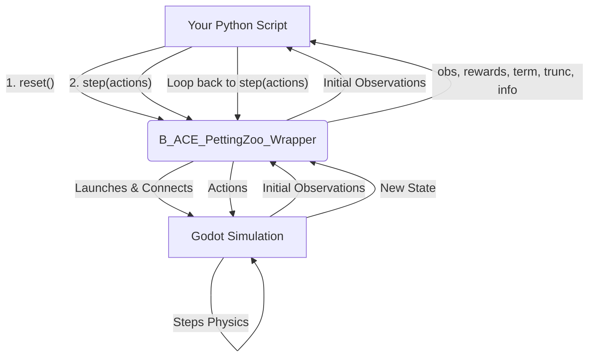

# B-ACE: Beyond Visual Range Air Combat Environment

[](https://opensource.org/licenses/MIT) [](https://www.python.org/downloads/) [](https://pettingzoo.farama.org/)

Built on the Godot game engine, B-ACE leverages Multi-Agent Reinforcement Learning (MARL) to explore advanced techniques in autonomous air combat agent development. The environment provides a flexible and accessible platform for the research community, enabling the rapid prototyping and evaluation of AI-based tactics and strategies in complex air combat settings.

## Key Features

* **Open-Source and Extensible:** Researchers can easily modify and extend the environment in both Python and the Godot Engine to suit their specific needs.
* **MARL-Ready:** Fully compatible with popular reinforcement learning libraries through the [PettingZoo](https://pettingzoo.farama.org/) API.
* **Simplified BVR Dynamics:** Focuses on the key aspects of air combat, offering a balance between realism and computational accessibility.
* **Flexible Scenarios:** Supports single and multi-agent learning scenarios, ideal for exploring both individual and cooperative agent behaviors.

## 🚀 Getting Started

The best way to start is by running the simple example to verify your setup. We recommend using a Python virtual environment.

**1. Prerequisites**

* Python 3.8 or higher
* Git

**2. Clone the Repository**

```bash
git clone [https://github.com/andrekuros/B-ACE.git](https://github.com/andrekuros/B-ACE.git)
cd B-ACE
```

**3. Set Up a Virtual Environment and Install Dependencies**

```bash
# Create a virtual environment (e.g., using venv)
python -m venv venv
# Activate it
# On Windows
venv\Scripts\activate
# On macOS/Linux
source venv/bin/activate

# Install the minimum requirements
pip install -r minimum_requirements.txt
```

**4. Run the Simple Example**
This will launch the Godot simulation and you will see the agents interacting in the environment.

```bash
python ./Examples/run_simple_example.py
```

## ⚙️ How It Works: Simulation Flow

The interaction between your Python agent code and the Godot simulation is managed by the `B_ACE_GodotPettingZooWrapper`. This wrapper is built using the excellent [GodotRL Agents](https://github.com/Dmitrii-I/GodotRL) library, which handles the low-level communication.

The wrapper implements the standard [PettingZoo ParallelEnv](https://pettingzoo.farama.org/api/parallel/) interface, allowing you to use familiar functions like `reset()` and `step()`.

The typical interaction flow is as follows:



## 📖 Usage and API

The B-ACE environment follows the Gym/PettingZoo standard. You just need to instantiate the wrapper and use its methods to control the simulation.

### Core Methods

* `__init__(**configs)`: Initializes the environment. It launches the Godot simulation, sets up observation/action spaces, and defines the agents based on the provided configuration.
* `reset()`: Resets the environment to its initial state, returning a dictionary of initial observations for each agent.
* `step(actions)`: Takes a dictionary of actions (one for each agent) and steps the environment forward. It returns the next observations, rewards, terminations, truncations, and info dictionaries.
* `observation_space(agent)`: Returns the observation space for a given agent.
* `action_space(agent)`: Returns the action space for a given agent.

### Interacting with the Environment

Here is a conceptual example of how to interact with the environment.

```python
import b_ace_py as b_ace
import numpy as np

# 1. Initialize the environment
# This will launch the Godot executable specified in the config
env = b_ace.B_ACE_GodotPettingZooWrapper(config_file="path/to/your/config.json")

# 2. Reset the environment for a new episode
observations, infos = env.reset()

# 3. Step through the simulation
for _ in range(1000):
    # Get a random action for each agent from its action space
    actions = {agent: env.action_space(agent).sample() for agent in env.agents}
    
    # Pass actions to the step function
    observations, rewards, terminations, truncations, info = env.step(actions)

    # If all agents are done, reset the environment
    if all(terminations.values()) or all(truncations.values()):
        observations, infos = env.reset()

env.close()
```

## 🔧 Environment Configuration

The simulation's behavior is controlled by a `.json` configuration file (e.g., `Default_B_ACE_config.json`). You can modify this file or pass the path to your own custom config during environment initialization.

**Key Configuration Options:**

* `EnvConfig`: General environment settings.
  * `env_path`: Path to the Godot executable binary.
  * `port`: Communication port.
  * `renderize`: Set to `true` to see the simulation, `false` for headless execution.
  * `speed_up`: Simulation speed multiplier.
  * `max_cycles`: Maximum steps per episode.
  * `action_type`: The type of action space, e.g., `"Low_Level_Continuous"` or `"Low_Level_Discrete"`.
  * `RewardsConfig`: Nested dictionary for all reward function parameters.
* `AgentsConfig`: Settings for the blue and red teams.
  * `blue_agents` / `red_agents`: Team-specific configurations.
  * `num_agents`: Number of agents on the team.
  * `base_behavior`: Default behavior (can be overridden by the RL agent).
  * `init_position`, `init_hdg`, `target_position`: Defines the mission scenario.

## 🖥️ Visualization & Debugging

One of the key advantages of using the Godot Engine is the ability to visualize the simulation in real-time. This is invaluable for debugging agent behavior and validating trained policies.

### Activating the Interface

You can control whether the graphical interface is displayed by setting the `renderize` parameter in your `.json` configuration file:

* `"renderize": true`: The Godot simulation window will launch. This is ideal for debugging, validation, and creating demonstrations.
* `"renderize": false`: The simulation runs in "headless" mode without a graphical window. This is significantly faster and should be used for training agents at scale.

Watching your agent perform in the rendered environment can provide insights that are not obvious from reward curves alone, helping you spot flawed tactics or confirm that a learned policy is behaving as expected.

## 🔬 RL Spaces Definition

### State Space (Observations)

The observation for each agent is a flat NumPy array. The size of the array depends on the number of allies and enemies configured for the scenario. The components of the observation vector are ordered as follows:

| Component Description | Number of Values | Notes |
|:---|:---|:---|
| **Agent State** | **8** | Information about the agent's own aircraft. |
| Agent Position (X, Y, Altitude) | 3 | Normalized coordinates. |
| Agent Heading & Speed | 2 |  |
| Distance & Aspect Angle to Goal | 2 |  |
| Number of Missiles Available | 1 |  |
| **Allies Info** (per ally) | **6** | Repeated for each allied aircraft. |
| Allied Altitude Diff & Dist to Agent | 2 |  |
| Allied Aspect Angle & Angle Off | 2 |  |
| Allied Distance to Goal | 1 |  |
| Allied Track Updated Flag | 1 | 1 if updated this frame, 0 otherwise. |
| **Enemies Info** (per enemy) | **11** | Repeated for each enemy track. Relies on radar. |
| Enemy Altitude Diff & Dist to Agent | 2 |  |
| Enemy Aspect Angle & Angle Off | 2 |  |
| Enemy Distance to Goal | 1 |  |
| Agent RMax & NEZ to Enemy | 2 | Weapon Engagement Zone data. |
| Enemy RMax & NEZ to Agent | 2 |  |
| Is Targeted by My Missile Flag | 1 | 1 if targeted, 0 otherwise. |
| Enemy Track Updated Flag | 1 | 1 if updated this frame, 0 otherwise. |

### Reward Function

The reward function uses large event-based rewards and smaller shaping rewards to guide the learning process. All values can be tuned in the `RewardsConfig` section of your configuration file.

| **Reward/Penalty Name** | **Default Value** | **Description** |
|---|---|---|
| `mission_completed` | `100.0` | **Event:** Positive reward for achieving the mission objective. |
| `hit_enemy` | `50.0` | **Event:** Positive reward for neutralizing an enemy aircraft. |
| `was_hit` | `-100.0` | **Event:** Negative penalty for being neutralized by an enemy. |
| `mission_shaping` | `0.001` | **Shaping:** Small reward proportional to progress towards mission goal. |
| `maintain_track` | `0.05` | **Shaping:** Small reward for each step an enemy is kept on radar. |
| `lost_track` | `-0.1` | **Shaping:** Small penalty for losing radar lock on a tracked enemy. |
| `fire_missile` | `-5.0` | **Shaping:** Penalty for firing a missile to discourage wasteful shots. |
| `miss_missile` | `-10.0` | **Shaping:** Penalty if a fired missile misses its target. |

### Action Space

The action space defines how agents interact with the simulation. The policy must learn to select an appropriate action at each step.

* **Continuous (`"Low_Level_Continuous"`):** The action is a NumPy array containing `[heading, flight_level, g_force, missile_firing]`. This allows for fine-grained control.
* **Discrete (`"Low_Level_Discrete"`):** The action is a single integer. The environment's wrapper decodes this integer into one of several predefined maneuvers (e.g., turn left, climb, fire missile).

## 🎮 Examples

The `Examples/` directory contains scripts to demonstrate how to use B-ACE with popular MARL frameworks.

### Simple Test

This example runs a basic loop with random actions. It's the best way to confirm your installation is working correctly.

```bash
python ./Examples/run_simple_example.py
```

### Tianshou Example

[Tianshou](https://tianshou.readthedocs.io/) is a flexible and efficient RL framework. To run this example, you will need to install Tianshou first.

```bash
pip install tianshou
# (Then run the example script)
python ./Examples/tianshou_example.py # (Path to your example script)
```

### BenchMARL Example

[BenchMARL](https://facebookresearch.github.io/BenchMARL/) is a framework for benchmarking MARL algorithms. To run this example, you will need to install its dependencies.

```bash
# (Install BenchMARL dependencies)
# (Then run the example script)
python ./Examples/benchmarl_example.py # (Path to your example script)
```

## 📄 Citation

If you use B-ACE in your research, please cite our paper:

```bibtex
@inproceedings{kuroswiski2024bace,
  author    = {Andre R. Kuroswiski and Annie S. Wu and Angelo Passaro},
  title     = {B-ACE: An Open Lightweight Beyond Visual Range Air Combat Simulation Environment for Multi-Agent Reinforcement Learning},
  booktitle = {Interservice/Industry Training, Simulation, and Education Conference (I/ITSEC) 2024},
  year      = {2024},
  month     = {December},
  paper     = {24464}
}
```

## Acknowledgements

This work was supported by the Brazilian Air Force Postgraduate Program in Operational Applications (PPGAO). We also thank the developers of the Godot Engine, PettingZoo, and GodotRL Agents for their invaluable open-source tools.

## License

This project is licensed under the MIT License - see the [LICENSE](LICENSE) file for details.
